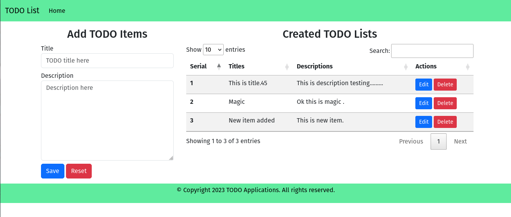

# A simple TODO application created in PHP

Created by **Md. Almas Ali**

```bash
# MySQL database configuration. change as ours.
$hostname = "localhost";
$username = "root";
$password = "";
$database = "todo_lists";
```


